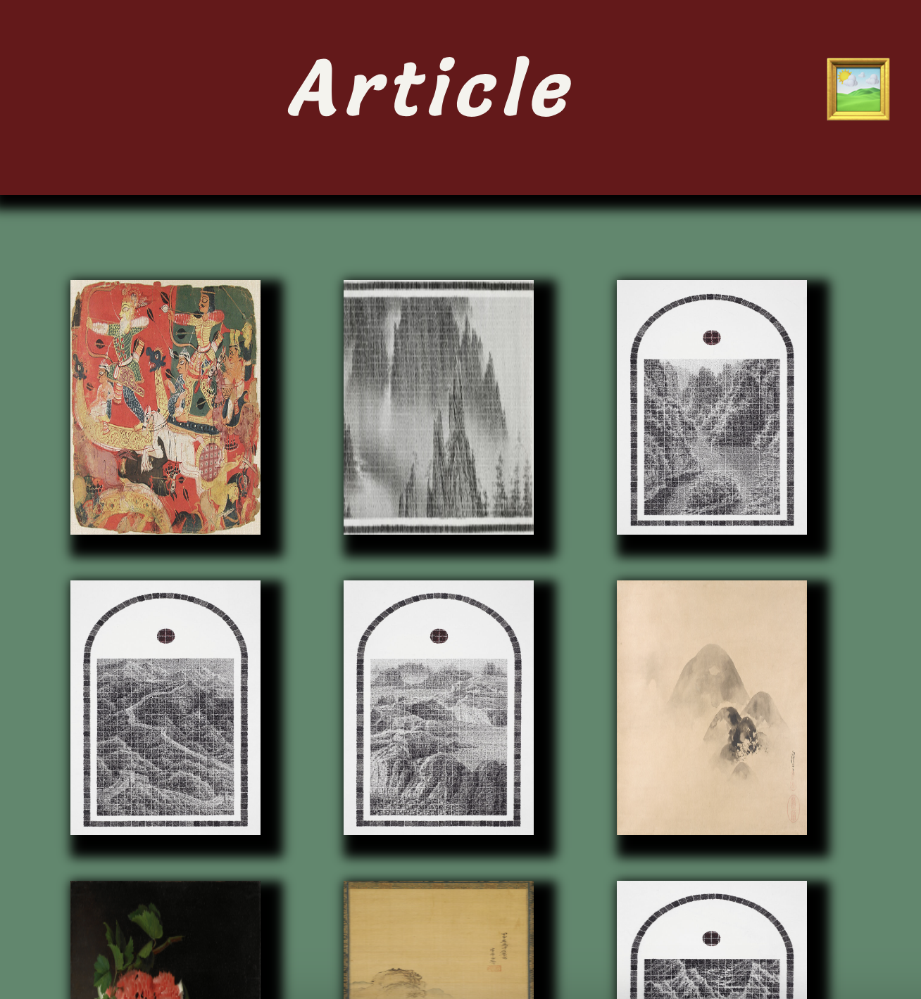

<h1 align=center> 🖼️ Article 🖼️<h1> 

 

<a href="https://article-zeta.vercel.app/" style="font-size: 30px;">Deployed Link</a>

## 🧑‍💻 👩🏻‍💻 🧑🏻‍💻 Contributors 
 
[Ben Rosner](https://github.com/ben-rosner-williamsburg)

## 📂 Tech Stack 

## 📚 Table of Contents

- [Overview](#overview)
- [Getting Started](#getting-started)
- [Preview](#preview)
- [Wins](#wins)
- [Future Ideas](#future-ideas)

<h2  id="overview">🌐 Overview </h2>

Article is an app used to educate people who are curious/interested in art or art history. It can also be used as a tool to teach students about art. 

<h2  id="getting-started">🗂️ Getting Started </h2>

1. Fork or clone down this respository. 
2. In the terminal, open this app by running the command `cd article`
3. Run the command  `npm install` to install dependencies.
4. Run the command `npm start` to start the server.
5. Open [http://localhost:3000](http://localhost:3000) to view it in your browser.
6. You can also view the project <a href="https://article-zeta.vercel.app/">here</a>.
7. Use control C to stop the server.
8. To test, run the command `npx cypress open`.

<h2  id="preview"> 🎥 Preview 📱 </h2>

 <h2 id="challenges">💪🏻 Challenges </h2>

💪🏻 Deploying with an API key.

💪🏻 Figuring out issues with Cypress tests and intercepting requests.

💪🏻 Time management. I need to learn how to plan out my time better.

<h2 id="wins">🏆 Wins </h2>

 🏆 Getting the project to look nice (CSS)
  
 🏆 Using condiitional rendering for header

 🏆 Error handling

 🏆 Using state

 🏆 Implementing PropTypes

<h2 id="future-ideas">💡 Future Ideas </h2>

🔮 Add a search feature 

🔮 Add more details on the detail page

🔮 Implement SASS instead of regular CSS